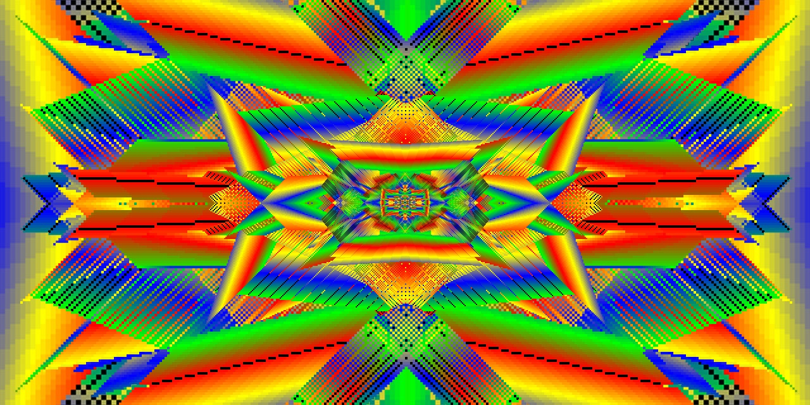

# Loop

Infinitely zooming pixel journey.



## STRUCTURE
```
├── public
│   ├── assets
│   |   ├── css
|   |   |   ├── style.css
|   |   |   └── style.min.css
│   |   ├── img
|   |   |   ├── atlas
|   |   |   |   └── atlas.png
|   |   |   ├── branding
|   |   |   |   ├── brand.png
|   |   |   |   └── logo-192x192.png
|   |   |   ├── canvas
|   |   |   |   ├── 1.jpg
|   |   |   |   ├── 2.jpg
|   |   |   |   ├── 3.jpg
|   |   |   |   ├── 4.jpg
|   |   |   |   ├── 5.jpg
|   |   |   |   ├── 6.jpg
|   |   |   |   ├── 7.jpg
|   |   |   |   ├── 8.jpg
|   |   |   |   ├── 9.jpg
|   |   |   |   ├── 10.jpg
|   |   |   |   ├── 11.jpg
|   |   |   |   ├── 12.jpg
|   |   |   |   ├── 13.jpg
|   |   |   |   ├── 14.jpg
|   |   |   |   ├── 15.jpg
|   |   |   |   ├── 16.jpg
|   |   |   |   ├── 17.jpg
|   |   |   |   ├── 18.jpg
|   |   |   |   ├── 19.jpg
|   |   |   |   ├── 20.jpg
|   |   |   |   ├── 21.jpg
|   |   |   |   ├── 22.jpg
|   |   |   |   ├── 23.jpg
|   |   |   |   ├── 24.jpg
|   |   |   |   ├── 25.jpg
|   |   |   |   ├── 26.jpg
|   |   |   |   ├── 27.jpg
|   |   |   |   ├── 28.jpg
|   |   |   |   ├── 29.jpg
|   |   |   |   ├── 30.jpg
|   |   |   |   ├── 31.jpg
|   |   |   |   └── 32.jpg
|   |   |   ├── covers
|   |   |   |   └── cover-1280x640.jpg
|   |   |   └── icons
|   |   |       ├── icon-16x16.png
|   |   |       ├── icon-32x32.png
|   |   |       ├── icon-60x60.png
|   |   |       ├── icon-76x76.png
|   |   |       ├── icon-96x96.png
|   |   |       ├── icon-120x120.png
|   |   |       ├── icon-144x144.png
|   |   |       ├── icon-152x152.png
|   |   |       ├── icon-180x180.png
|   |   |       └── icon-192x192.png
│   |   ├── js
|   |   |   ├── app.js
|   |   |   └── app.min.js
│   |   └── libs
|   |       └── jquery-3.5.1.min.js
|   └── uploads
|       └── .empty 
├── favicon.png
├── index.html
├── LICENSE
├── README.md
└── screenshot.jpg
```

## BUILT WITH
- [jQuery 3.5.1](https://github.com/jquery/jquery/releases/tag/3.5.1)

## CONTRIBUTOR
Oleksandr Klochko [@utoyvo](https://github.com/utoyvo).

## LICENSE
Code released under the [MIT](LICENSE).
